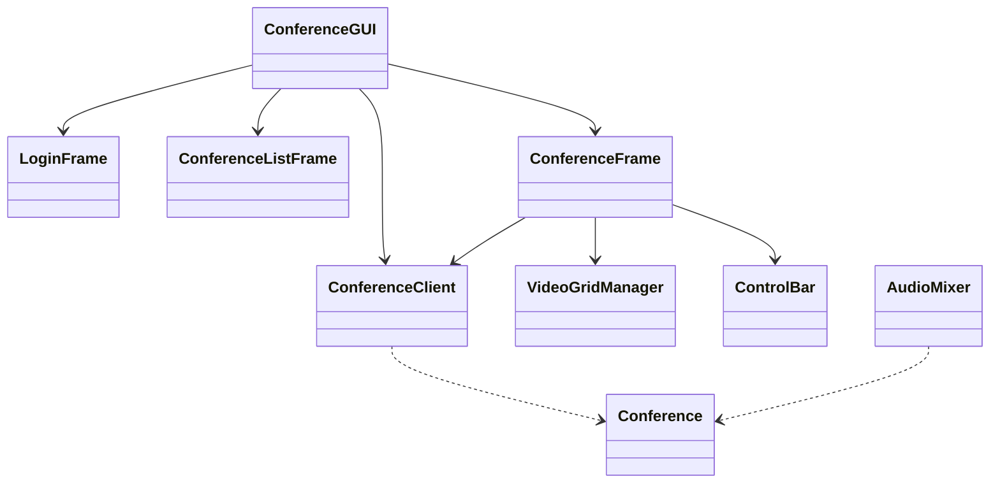

# 视频会议系统类结构说明

## 类关系图



## 核心类说明

### 1. ConferenceClient (conf_client.py)

主要职责：管理与服务器的通信，处理会议相关的所有网络操作。

重要属性：
- `sio`: 主Socket.IO客户端实例
- `video_sio`: 视频Socket.IO客户端实例
- `screen_sio`: 屏幕共享Socket.IO客户端实例
- `conference`: 当前会议实例
- `user_id`: 用户唯一标识符

关键方法：
```python
async def connect()
# 连接到服务器的所有通道（主通道、视频通道、屏幕共享通道）

async def create_conference(conf_name, username)
# 创建新会议

async def join_conference(conf_id, username)
# 加入指定的会议

async def leave_conference()
# 离开当前会议

async def send_video(video_data)
# 发送视频流数据

async def send_audio(audio_data)
# 发送音频流数据

async def send_screen_share(screen_data)
# 发送屏幕共享数据
```

### 2. VideoGridManager (VideoManager.py)

主要职责：管理视频显示界面的布局和更新。

重要属性：
- `video_frames`: 存储所有视频帧的字典
- `screen_share_frame`: 屏幕共享显示框架
- `is_screen_sharing`: 屏幕共享状态标志

关键方法：
```python
def add_video(participant_id, initial_image=None)
# 添加新的视频显示框

def update_video(participant_id, image)
# 更新指定参与者的视频帧

def update_layout()
# 更新视频网格布局

def start_screen_share(sharer_id)
# 开始屏幕共享显示

def update_screen_share(image)
# 更新屏幕共享内容

def stop_screen_share(sharer_id)
# 停止屏幕共享显示
```

### 3. AudioMixer (AudioMixer.py)

主要职责：处理多路音频流的混合。

重要属性：
- `audio_buffers`: 存储各用户音频流的字典

关键方法：
```python
def add_audio_stream(user_id, audio_data)
# 添加用户的音频流到缓冲区

def mix_audio()
# 混合所有音频流，返回混合后的音频数据

def remove_audio_stream(user_id)
# 移除指定用户的音频流
```

### 4. ConferenceGUI (GUI.py)

主要职责：主窗口管理，处理界面切换。

重要属性：
- `client`: ConferenceClient实例
- `current_frame`: 当前显示的框架
- `loop`: asyncio事件循环

关键方法：
```python
def switch_frame(frame_class)
# 切换显示的框架

async def shutdown()
# 关闭应用程序时的清理工作
```

### 5. ConferenceFrame (GUI.py)

主要职责：会议室界面管理。

重要属性：
- `video_manager`: VideoGridManager实例
- `control_bar`: ControlBar实例
- `client`: ConferenceClient实例

关键方法：
```python
async def start_video()
# 开始视频流传输

async def start_audio()
# 开始音频流传输

async def start_screen_share()
# 开始屏幕共享

def handle_mic_toggle(should_enable)
# 处理麦克风开关

def handle_camera_toggle(should_enable)
# 处理摄像头开关

def handle_screen_toggle(should_enable)
# 处理屏幕共享开关
```

### 6. ControlBar (Controlbar.py)

主要职责：提供会议控制按钮。

重要属性：
- `mic_button`: 麦克风控制按钮
- `camera_button`: 摄像头控制按钮
- `screen_button`: 屏幕共享控制按钮

关键方法：
```python
def toggle_mic()
# 切换麦克风状态

def toggle_camera()
# 切换摄像头状态

def toggle_screen()
# 切换屏幕共享状态
```

### 7. Conference (protocol.py)

主要职责：定义会议数据结构。

重要属性：
- `id`: 会议ID
- `name`: 会议名称
- `creator_id`: 创建者ID
- `participants`: 参与者字典

关键方法：
```python
def to_dict()
# 将会议信息转换为字典格式

@classmethod
def from_dict(cls, data)
# 从字典创建会议实例
```

## 关键类关系说明

1. 数据流向：
   - `ConferenceClient` 负责与服务器通信
   - `ConferenceFrame` 通过 `ConferenceClient` 发送和接收数据
   - `VideoGridManager` 负责显示接收到的视频流
   - `AudioMixer` 负责处理接收到的音频流

2. 控制流向：
   - `ConferenceGUI` 控制整体界面切换
   - `ControlBar` 控制音视频和屏幕共享的开启/关闭
   - `ConferenceFrame` 协调各个组件的工作

3. 事件处理：
   - `ConferenceClient` 接收服务器事件
   - `ConferenceFrame` 处理UI事件
   - `VideoGridManager` 处理视频显示事件

## 示例：视频流程

1. 用户点击摄像头按钮
2. `ControlBar` 触发回调
3. `ConferenceFrame` 调用 `start_video()`
4. 视频帧通过 `ConferenceClient` 发送到服务器
5. 其他客户端接收视频帧
6. `VideoGridManager` 更新显示

## 示例：屏幕共享流程

1. 用户点击屏幕共享按钮
2. `ControlBar` 触发回调
3. `ConferenceFrame` 调用 `start_screen_share()`
4. 屏幕帧通过 `ConferenceClient` 发送到服务器
5. 其他客户端接收屏幕共享帧
6. `VideoGridManager` 显示共享内容
